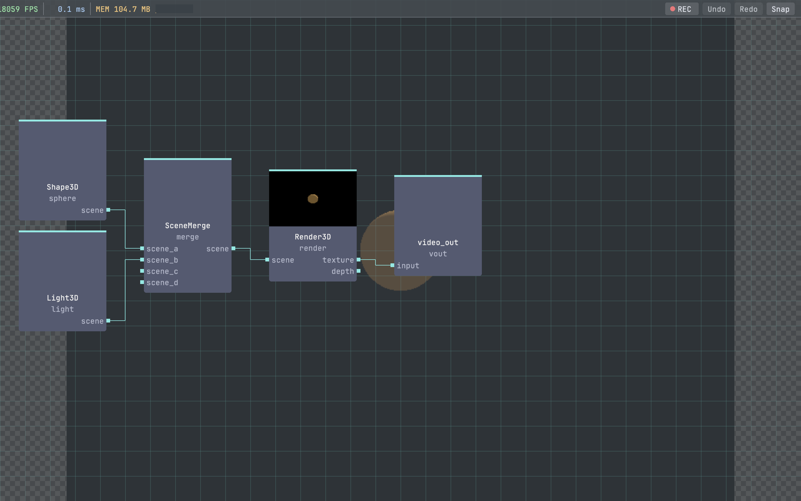

# vivid-3d

`vivid-3d` is a Vivid package library for 3D-focused operators.

## Preview



## Local development

From vivid-core:

```bash
./build/vivid link ../vivid-3d
./build/vivid rebuild vivid-3d
```

## Beginner Compute Shader Demo

`Particles3D` now supports an opt-in beginner path via `learning_mode = Beginner`.

In this mode, the operator uses a simplified compute flow intended for learning:

1. update particle state in a storage buffer (spawn + gravity + lifetime/bounds reset)
2. write per-instance transform/color data
3. render that instance buffer with the normal 3D renderer

Try graph: `graphs/3d_particles_compute_beginner_demo.json`

## Shadow And Fog Examples

- `graphs/3d_shadow_focus_demo.json`: focused shadow-map demo (high-contrast floor + caster setup).
- `graphs/3d_fog_fake_post_demo.json`: fake atmospheric fog look using post-processing only.
- `graphs/3d_fog_true_demo.json`: true depth-based fog in `Render3D` via `fog_*` params.

Use fake fog for stylized screen-space haze. Use true fog for distance-aware atmospheric falloff.

## License

MIT (see `LICENSE`).
