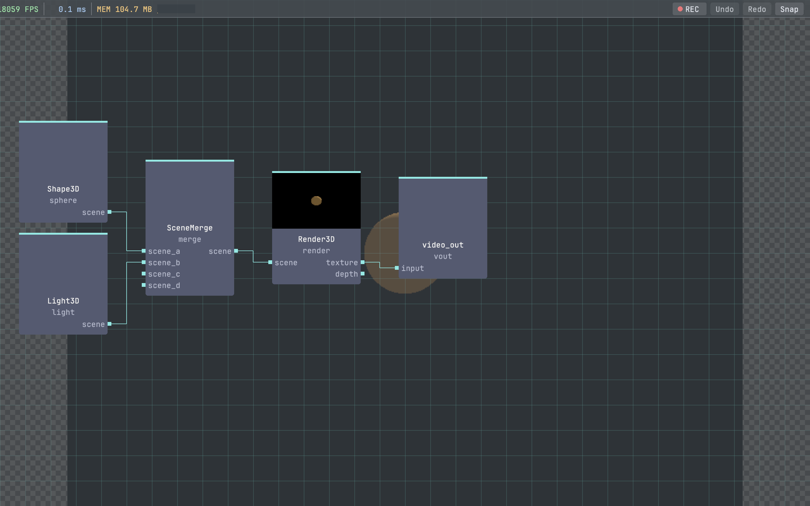

# vivid-3d

`vivid-3d` is a package library for building lit 3D scenes inside Vivid. It focuses on geometry sources, scene composition, materials, lighting, instancing, and 3D post-processing.

## Preview



## Package docs model

- this `README.md` is the package overview used by the central Vivid docs site
- operator reference pages are generated from source doc block comments in `operators/`
- graphs under `graphs/` are the active demo surface for smoke coverage and package examples

## Highlights

- procedural primitives: `Grid`, `Box`, `Sphere`, `Shape3D`, `MeshBuilder`, `Sweep`, `SDF3D`
- scene utilities: `Transform3D`, `SceneMerge`, `Instancer3D`, `MeshDraw`, `MeshImport`
- look development: `Material3D`, `Light3D`, `Environment3D`, `Boolean3D`
- rendering and post: `Render3D`, `SSAO3D`, `DepthOfField3D`, `DepthMask3D`
- motion systems: `Particles3D`, `Deformer`

## Install

```bash
./build/vivid install https://github.com/seethroughlab/vivid-3d.git
```

## Local development

From vivid-core:

```bash
./build/vivid link ../vivid-3d
./build/vivid rebuild vivid-3d
```

## Example graphs

- `graphs/3d_hello_world_demo.json` — first lit scene
- `graphs/3d_shapes_demo.json` — procedural primitive overview
- `graphs/3d_materials_demo.json` — material and lighting comparison
- `graphs/3d_particles_demo.json` — particle workflow
- `graphs/3d_particles_compute_beginner_demo.json` — simplified compute path for learning
- `graphs/3d_shadow_focus_demo.json` — focused shadow-map setup
- `graphs/3d_fog_fake_post_demo.json` — stylized post-process fog
- `graphs/3d_fog_true_demo.json` — depth-aware fog in `Render3D`

## Validation

Before pushing changes:

1. Configure and build the package operators.
2. Run package tests if present.
3. Validate the link/rebuild cycle from vivid-core.
4. Run `test_demo_graphs` against this package's `graphs/` directory.
5. Treat GPU-heavy graph smoke as load and registry coverage first; skipped no-GPU runs are acceptable in headless CI.

## License

MIT (see `LICENSE`).
